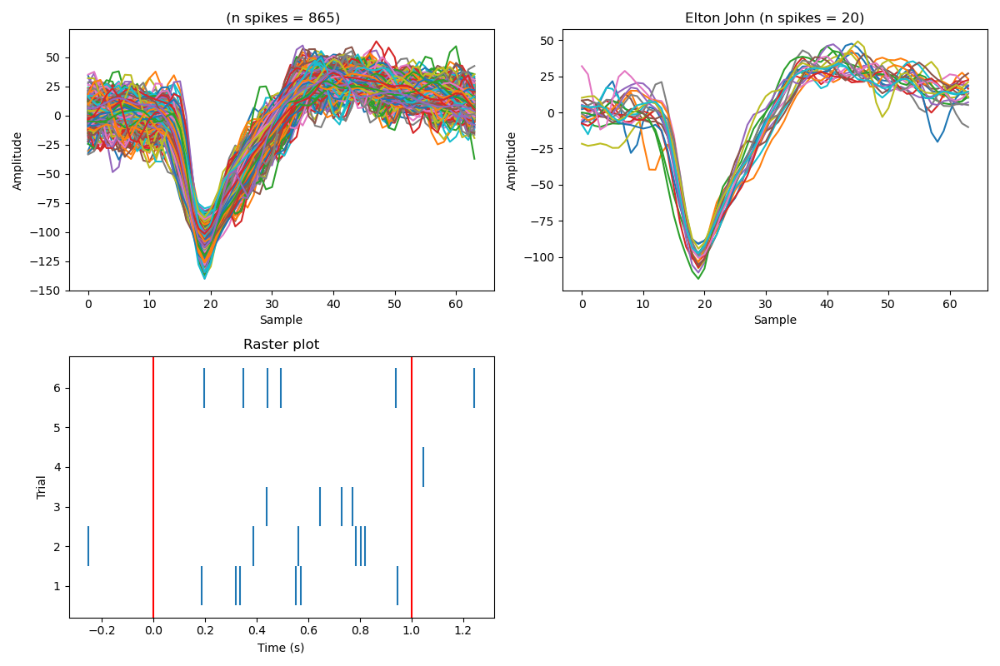

# Spike clustering using Combinato

The scripts found here convert `.ns6` files—containing time series for each channel per participant—into separate `.mat` files.  
Each `.mat` file contains the data for a single channel.

`.ns6` files can be converted to `.mat` using `convert_ns6_to_mat.py`.

Once converted, spike sorting can be performed from the command line using `cluster_data.sh`.

The clustering requires a [Combinato installation](https://github.com/jniediek/combinato/).

Once clustered, `main.py` can be used to align the clusters with the behavioural data and and to detect concept cells. Concept cells are detected using the procedure presented in [Quiroga et al. (2005)](https://pubmed.ncbi.nlm.nih.gov/15973409/). Use the `--save` flag to ensure intermediate files are saved.

`--save` will result in the following files being saved:

- `all_spike_waveforms.csv` a csv containing waveforms for all the detected spikes along with labels concerning what clusters they belonged to and which stimilus was on the screen during the spike. If the spike occured during a baseline period, the stimulus will be "BASELINE".

- `all_events.csv` a csv containing the time intervals for each behavioural trial with an entry for each ppt, sensor and cluster detected by combinato. 

- `spike_counts.csv` a csv that is identical to `all_events.csv` but contains a column for the number of spikes that occured on that specific trial.

- `detected_concepts.csv` a csv outlining the concept cells that were detected

- `raster_data.pkl` a pickle containing the Python object needed for plotting the raster plots.

Once `main` has been run, `cmdline_plot.py` can be used to plot individual concept cells.  `cmdline_plot.py` has four required positional arguments: *ppt, sensor, unit, stimulus*. As defined in `detected_concepts.csv`.

`cmdline_plot.py` will provide three plots. A plot of all the spikes detected in that cluster. A plot of only the spikes that occured while the stimulus was on the screen. A raster plot showing the spikes across the six presentations of the stimulus. 

For example, `python3 cmdline_plot.py 002 5 6 "Elton John"` could return: 

