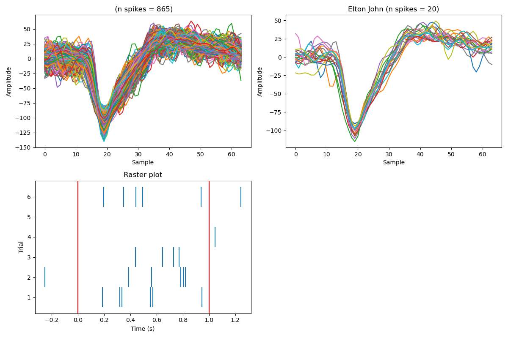

# Concept Cell Pipeline

The scripts found here convert `.ns6` files—containing time series for each channel per participant—into separate `.mat` files.  
Each `.mat` file contains the data for a single channel.
After conversion, Combinato can be used to cluster the data.

The conversion script requires you to provide a `.csv` containing the sensors you want to include.
To select the sensors use `create_sensor_inspect_sheet.py` to create a csv containing labels and statistics from each sensor.

Copy and paste the pateint, visit, path (run), and chan_id for each selected sensor into a separate csv called `selected_sensors.csv`.

`.ns6` files can be converted to `.mat` using `convert_and_concat_manualy_selected.py`. This script will use `selected_sensors.csv` to extract only the selected signals and concatenate all run within the same patient/visit.

This script requires the use of [BlackRock's Python Utilities](https://github.com/BlackrockNeurotech/.Python-Utilities). The brpylib folder needs to be in `Lib/site-packages/` directory of the Python environement.

Once converted, spike sorting can be performed from the command line using `cluster_data.sh`.

The clustering requires a [Combinato installation](https://github.com/jniediek/combinato/).

Once clustered, the indidividual tasks can be deconcatenated using `slice_runs_after_clustering.py`

Spikes, their times and metadata can then be arranged into a csv using `create_spike_csv.py`

Currently working on the script `create_behaviour_csv.py`. Some behavioural files appear to be in ms where as others seem to be in seconds. thi needs fixing. It is unclear whether the behavioural data and the ieeg data begin at the same time. Need to figure out how to align them. 

## OLD

- `all_spike_waveforms.csv` a csv containing waveforms for all the detected spikes along with labels concerning what clusters they belonged to and which stimilus was on the screen during the spike. If the spike occured during a baseline period, the stimulus will be "BASELINE".

- `all_events.csv` a csv containing the time intervals for each behavioural trial with an entry for each ppt, sensor and cluster detected by combinato. 

- `spike_counts.csv` a csv that is identical to `all_events.csv` but contains a column for the number of spikes that occured on that specific trial.

- `detected_concepts.csv` a csv outlining the concept cells that were detected

- `raster_data.pkl` a pickle containing the Python object needed for plotting the raster plots.

Once `main` has been run, `cmdline_plot.py` can be used to plot individual concept cells.  `cmdline_plot.py` has four required positional arguments: *ppt, sensor, unit, stimulus*. As defined in `detected_concepts.csv`.

`cmdline_plot.py` will provide three plots. A plot of all the spikes detected in that cluster. A plot of only the spikes that occured while the stimulus was on the screen. A raster plot showing the spikes across the six presentations of the stimulus. 

For example, `python3 cmdline_plot.py 002 5 6 "Elton John"` could return: 

